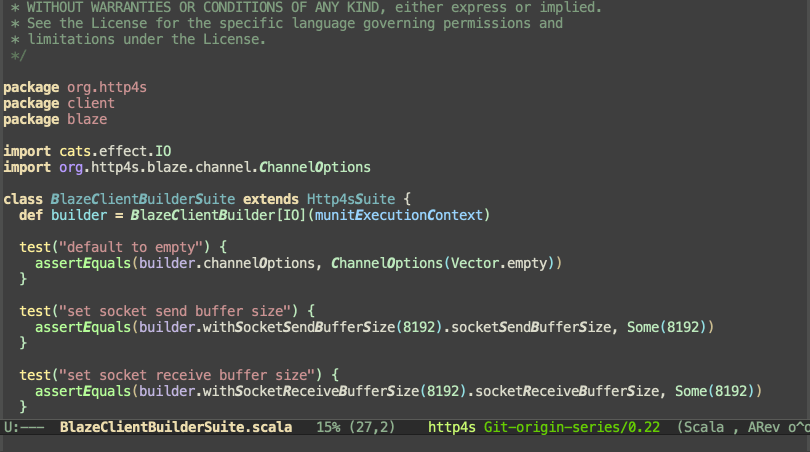

# Sbt test runner

Convenient functions for quickly selecting Scala test file to run.

## Goal of the project

Goal of this project is to be able to run Scala test files with minimal setup. Only tool necessary is to have sbt 1.4.x project and to have enabled [sbt-tests-metadata](https://github.com/VlachJosef/sbt-tests-metadata) sbt plugin.

## Dependencies

For following commands to work you need to have enabled [sbt-tests-metadata](https://github.com/VlachJosef/sbt-tests-metadata) sbt plugin in your project and you have to be using **sbt 1.4.x**.

Easiest way to enable `sbt-tests-metadata` plugin is adding following line into global `~/.sbt/1.0/plugins/plugins.sbt` file:

```
addSbtPlugin("vlach" % "sbt-tests-metadata" % "0.1.0-SNAPSHOT")
```

## Available commands

All following commands ultimately runs `testOnly` sbt command.

```
project/testOnly foo.bar.BazSpec
```

### Select from all

```elisp
(sbt-test-select-all-tests)
```

Choose from all available tests across **all projects** to select the one to run.




### Select from current project

```elisp
(sbt-test-select-project-tests)
```

Choose from all available tests for **current projects** to select the one to run.

Current project in this context is the project to which current buffer's file belongs to.


### Run current test file

```elisp
(sbt-test-run-current)
```

Directly runs current Scala test file.


## Special munit support

Since [munit](https://scalameta.org/munit/) allows only one way to define test, it is relative easy to detect all runnable test names just by parsing current scala file for `test(...)` occurences, and presenting these to the user for selecting desired test to run.

When in munit file two additional commands are available.

### Select test to run in current test file

Choose single test to run from all available tests in current test file.
Only available if your test file is **munit**.

```elisp
(sbt-test-munit-select-test)
```

### Select current test only

Like `(sbt-test-munit-select-test)` but puts current test as initial input.

Note. Current test is closest preceeding test relative to the `(point)` or the first test if `(point)` is before first test.

```elisp
(sbt-test-munit-prefer-current)
```

## How it works

todo
